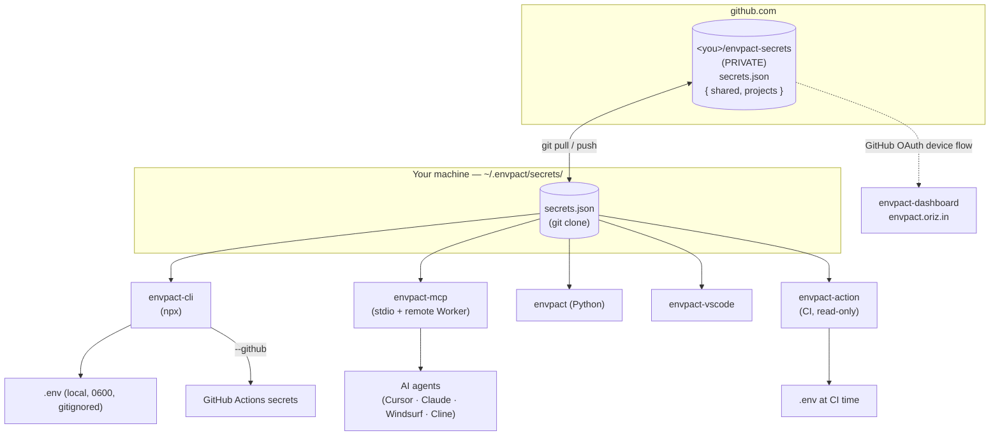

# envpact

> A `$0`, serverless, Git-backed secrets manager for solo developers running 100+ public repos.

[](https://www.npmjs.com/package/envpact-cli)
[](https://www.npmjs.com/package/envpact-mcp)
[](https://pypi.org/project/envpact/)
[](https://marketplace.visualstudio.com/items?itemName=chirag127.envpact)
[](https://open-vsx.org/extension/chirag127/envpact)
[](./LICENSE)
[](https://github.com/chirag127/envpact/stargazers)
[](https://github.com/chirag127/envpact/commits)

**Live site:** https://envpact.oriz.in · **GHP landing:** https://chirag127.github.io/envpact/ · **Repo:** https://github.com/chirag127/envpact

⭐ If this is useful, please star the repo — it helps others find it.

`envpact` (env + pact) is a binding contract between you and your secrets: a single **private** GitHub repo with one `secrets.json` becomes the source of truth for every project you maintain. Reuse shared keys via `shared.KEY`. Rotate once → every project resolves the new value on next run. No SaaS subscription, no server to host, no project-count limit. AI agents read it over MCP; CI/CD reads it via the GitHub Action; you read it via CLI, VS Code, or the web dashboard.

## Architecture



Every component reads & writes the **same vault** using the **same resolution algorithm** (see [SHARED_SPEC](./_build/specs/SHARED_SPEC.md)). Switching between them is seamless.

## Features

- **One private vault, DRY references** — reference a shared key once as `shared.OPENAI_API_KEY`; never repeat it across 40 repos.
- **Rotate once, everywhere** — `envpact-cli --rotate KEY` updates the source; all projects resolve the new value next run.
- **Local `.env` generation** — written mode 0600 and auto-added to `.gitignore`; `.env` is never committed.
- **GitHub Actions sync** — `envpact-cli --github` pushes resolved values as repo secrets.
- **AI-agent native** — MCP server (stdio + a remote Cloudflare Worker at `mcp.envpact.oriz.in/mcp`) lets Cursor / Claude / Windsurf / Cline read & write the vault.
- **Opt-in `age` encryption** — values prefixed `enc:` are decrypted on read with your local key; non-CLI ports refuse to leak ciphertext.
- **Six interchangeable ports** — CLI, MCP, Python, VS Code, GitHub Action, dashboard.

## Ecosystem

| Component | Subdir (submodule) | Install |
| :--- | :--- | :--- |
| **CLI** (Node) | [envpact-cli](https://github.com/chirag127/envpact-cli) | `npx envpact-cli` |
| **MCP server** | [envpact-mcp](https://github.com/chirag127/envpact-mcp) | add `npx -y envpact-mcp` to your agent's MCP config, or the remote `mcp.envpact.oriz.in/mcp` |
| **Python module** | envpact-python | `pip install envpact` |
| **GitHub Action** | [envpact-action](https://github.com/chirag127/envpact-action) | `chirag127/envpact-action@v0` |
| **VS Code extension** | [envpact-vscode](https://github.com/chirag127/envpact-vscode) | `ext install chirag127.envpact` (also on [Open VSX](https://open-vsx.org/extension/chirag127/envpact)) |
| **Web dashboard** | [envpact-dashboard](https://github.com/chirag127/envpact-dashboard) | https://envpact.oriz.in |

## Tech stack

Node.js / TypeScript (CLI, MCP, VS Code) · Python (module) · static web dashboard (GitHub OAuth device flow, client-side) · `age` for opt-in encryption · Git as the transport & trust root · Cloudflare Pages (dashboard) + Worker (remote MCP). Zero runtime deps in the core resolver.

## Repo structure

```
envpact-cli/         # Node CLI (git submodule)
envpact-mcp/         # MCP server, stdio + remote Worker (git submodule)
envpact-vscode/      # VS Code extension (git submodule)
envpact-dashboard/   # static web dashboard (git submodule)
envpact-action/      # GitHub Action, read-only (git submodule)
_build/specs/        # SHARED_SPEC — canonical resolution algorithm
docs/                # architecture, security, environments, schema
scripts/             # setup-secrets.sh, release-all.sh
AUDIT.md · TOKENS.md · TOOLING.md · AGENTS.md
```

## Quick start

```bash
# 1. Bootstrap your private vault (creates {you}/envpact-secrets via gh CLI)
npx envpact-cli --init auto

# 2. In any project with a .env.example
cd my-app
npx envpact-cli            # resolves shared refs, prompts for missing, writes .env

# 3. Sync to GitHub Actions secrets for CI/CD
npx envpact-cli --github
```

Work on multiple components at once:

```bash
git clone --recursive https://github.com/chirag127/envpact.git
cd envpact
git submodule update --recursive --remote
```

## Configuration

Env vars the **monorepo itself** needs to publish, deploy, and operate (see [`.env.example`](./.env.example) for names; acquisition steps in [TOKENS.md](./TOKENS.md)). Populate them into your own vault with `npx envpact-cli`.

| Variable | Purpose |
| :--- | :--- |
| `NPM_TOKEN` | Publish `envpact-cli` / `envpact-mcp` to npm. |
| `VSCE_PAT` | Publish the extension to the VS Code Marketplace. |
| `OVSX_PAT` | Optional: mirror the extension to Open VSX. |
| `CLOUDFLARE_API_TOKEN` | Deploy the dashboard to Cloudflare Pages. |
| `CLOUDFLARE_ACCOUNT_ID` | Cloudflare account for the deploy. |
| `PUBLIC_GITHUB_OAUTH_CLIENT_ID` | Dashboard GitHub OAuth device-flow client id (public; no secret in device flow). |
| `GITHUB_TOKEN` | Optional override for CLI `--github` sync (auto-detects `gh` auth otherwise). |
| `PYPI_API_TOKEN` | Bootstrap PyPI upload before Trusted-Publisher OIDC takes over. |

## Security note

No secrets in this repo. The trust model is **"keep the vault repo private"** — envpact only deduplicates and enables rotation; GitHub is the trust root. `.env` files are written 0600 and gitignored; secret values are never printed in `--list-shared`, MCP responses, VS Code trees, or dashboard tables. `age` encryption is opt-in per secret. `PUBLIC_*` values are client-only; the dashboard is 100% client-side with tokens in `sessionStorage`. See [docs/security.md](./docs/security.md) and [AUDIT.md](./AUDIT.md).

## Part of the oriz family

One of ~80 sites and tools in the [oriz](https://blog.oriz.in) family by Chirag Singhal — the dashboard runs **$0 on the Cloudflare free tier**. Sibling: [envpact-vscode-vsc-ext](https://github.com/chirag127/envpact-vscode-vsc-ext) (the standalone VS Code extension mirror) · other AI-agent tooling like [ghosttyper-bs-ext](https://github.com/chirag127/ghosttyper-bs-ext).

## Contributing

Each sub-component has its own `CONTRIBUTING.md`; this umbrella repo tracks submodule pointers. See [CONTRIBUTING.md](./CONTRIBUTING.md). Conventional commits are the changelog.

## Status

Stable — every package is published. Two MAJOR audit items (cross-port resolver parity tests, vault-write file locking) are deferred to v0.3.0; see [AUDIT.md](./AUDIT.md).

## License

MIT © Chirag Singhal — chirag@oriz.in · see [LICENSE](./LICENSE).
